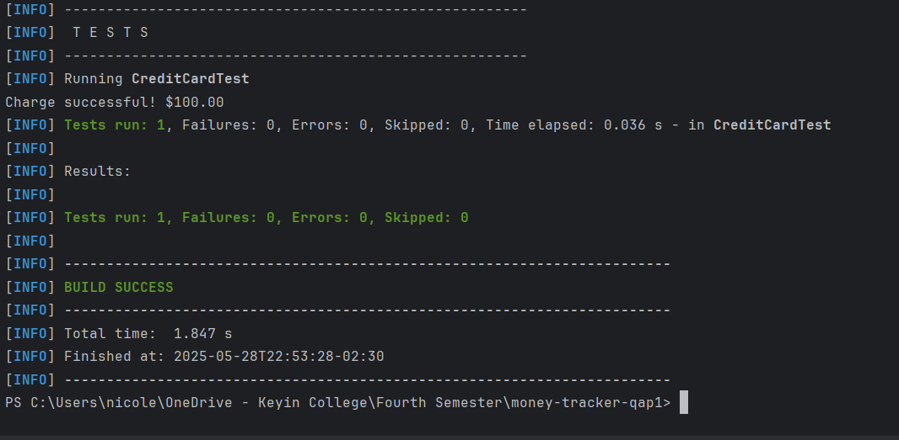

# Beginner Credit Card Tracker (QAP1 - SDAT and DevOps Combined)

A command-line Java application simulating basic credit card operations such as charges and payments. This project was built for QAP1 to demonstrate:
- Java development
- Clean code
- Unit testing (JUnit 5)
- Maven build configuration
- GitHub Actions CI
- Trunk-based development

---

## 📌 Project Overview

This Java CLI-based app simulates a credit card for beginner users. Users can:
- Charge money to a card (if within the credit limit)
- Make payments to reduce the balance
- View the balance and personal information

All operations are demonstrated via the `CreditCardDemo` class.

---

## ✅ Features

- Object-oriented Java: clean design using `CreditCard`, `Person`, `Address`, and `Money` classes
- Test-driven development with JUnit 5
- CI workflow using GitHub Actions
- Project managed with Maven (pom.xml)

---

## 💻 How It Works

```text
CreditCardDemo.java initializes:
✔️ Person + Address
✔️ CreditCard with a limit
✔️ Charges and payments applied
✔️ Outputs printed to terminal

🧪 Unit Testing
Tests written with JUnit 5, covering:

✅ Positive and negative charge scenarios

✅ Balance update verification

✅ Payment reduction logic

mvn test

✅ Test Cases:
Test	What It Verifies
testChargeWithinLimit()	Valid charges are added to balance
testChargeOverLimitFails()	Charges over the limit are rejected
testPaymentReducesBalance()	Payments reduce outstanding balance
testMultipleChargesAndPayments()	Chaining logic works correctly
testNegativeChargeDoesNotApply()	Edge case for negative amounts

📸 Insert screenshot here of IntelliJ test results


🔁 Clean Code Practices Used
1. Separation of Concerns
Each class has a single, clear responsibility.

java
Copy
Edit
public class Money {
    public Money add(Money other) { ... }
}

2. Descriptive Naming
Method names explain intent clearly:

java
Copy
Edit
public void charge(Money amount)

3. Readable Output
Formatted money display:

java
Copy
Edit
@Override
public String toString() {
    return String.format("$%.2f", amount);
}
📸 Add 3 screenshots here:


🤖 GitHub Actions (CI/CD)
CI configured to run tests on every pull request.

📁 .github/workflows/maven.yml:

yaml
Copy
Edit
name: Java CI

on: [pull_request]

jobs:
  build:
    runs-on: ubuntu-latest
    steps:
      - uses: actions/checkout@v3
      - name: Set up JDK
        uses: actions/setup-java@v3
        with:
          java-version: '17'
          distribution: 'temurin'
      - name: Build and Test
        run: mvn clean verify
📸 Add screenshot here:


📦 Maven Dependencies
pom.xml includes:
xml
Copy
Edit
<dependency>
  <groupId>org.junit.jupiter</groupId>
  <artifactId>junit-jupiter</artifactId>
  <version>5.10.0</version>
  <scope>test</scope>
</dependency>

<plugin>
  <groupId>org.apache.maven.plugins</groupId>
  <artifactId>maven-surefire-plugin</artifactId>
  <version>2.22.2</version>
</plugin>
📌 From: Maven Central

🌿 Dev/Trunk-Based Workflow
This project uses trunk-based Git workflow:

Feature branch: feature/tests

Pull Request merged into main

GitHub Actions triggered

📸 Screenshot suggestion:


🐛 Problems Encountered
Issue	How It Was Solved
Maven plugin not found	Changed to stable version 2.22.2
JUnit test classes not detected	Moved to src/test/java, added Surefire plugin
GitHub Actions didn't run	Fixed .yml path and pull request trigger
IntelliJ didn't run tests	Verified Maven dependency and test folder setup

🔗 Submission Info
GitHub Repo: https://github.com/YOUR_USERNAME/money-tracker-qap1

📸 Add screenshots in /screenshots and update file paths in this README.